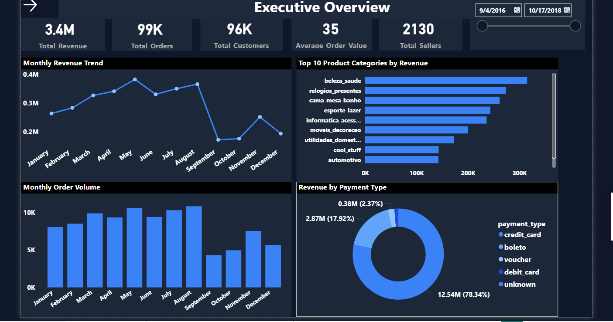
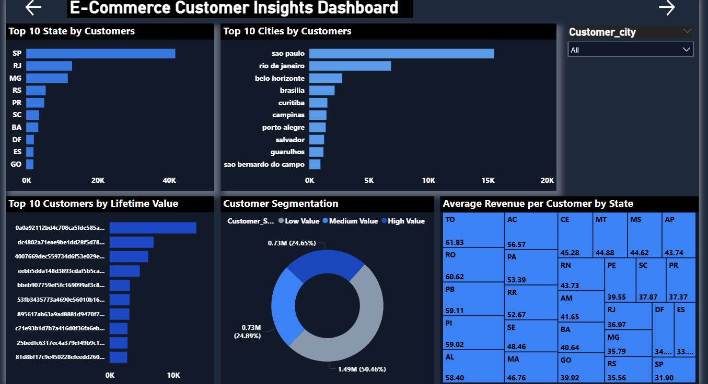
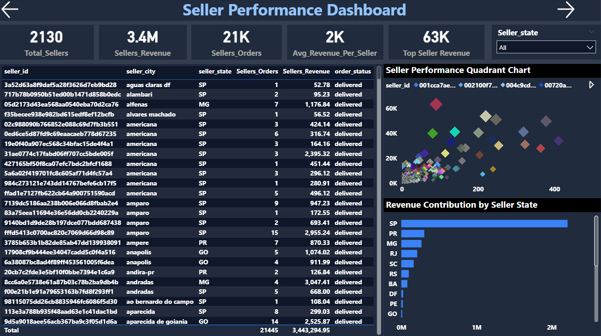
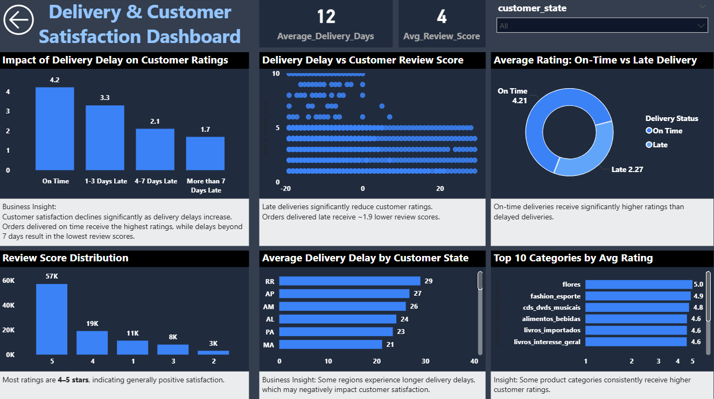

# 🛒 Ecommerce Sales Analysis

End-to-end data analysis project using Python, SQL, and Power BI.

---

## 📌 Problem Statement

In the e-commerce industry, large volumes of data are generated from customers, orders, sellers, and payments. However, raw data alone cannot provide meaningful insights.

The objective of this project is to analyze e-commerce data to identify revenue trends, customer behavior, seller performance, and the impact of delivery on customer satisfaction.

---

## 🎯 Objectives

* Analyze revenue trends and peak sales periods
* Identify top-performing products and categories
* Understand customer distribution and segmentation
* Evaluate seller performance
* Analyze delivery efficiency and customer satisfaction

---

## 📂 Dataset Description

The dataset contains:

* Customers
* Orders
* Order Items
* Products
* Payments
* Sellers
* Reviews

These datasets help analyze business performance from multiple perspectives.

---

## ⚙️ Methodology

### 🐍 Data Cleaning (Python)

* Handled missing values
* Converted date columns
* Created new features:

  * delivery_days
  * delivery_delay_days
  * total_item_value
  * product_volume

---

### 🗄️ Data Analysis (SQL)

* Performed joins and aggregations
* Analyzed revenue, customers, sellers, and delivery
* Created KPIs and business metrics

👉 Full SQL queries available in:
`SQL/analysis_queries.sql`

---

### 📊 Data Visualization (Power BI)

* Built 4 interactive dashboards
* Used DAX for calculations
* Applied filters and slicers

---

## 📊 Dashboards

### Executive Overview

### Customer Insights

### Seller Performance

### Delivery & Satisfaction

---

## 📊 Key Insights

### 💰 Revenue

* Total revenue ~ **3.4M**
* Peak sales observed between **May–August**
* Few categories contribute majority revenue

### 💳 Payments

* Credit card contributes ~ **78% revenue**

### 👥 Customers

* Majority customers from **São Paulo (SP)**
* High-value customers generate significant revenue

### 🧑‍💼 Sellers

* Top sellers contribute major share of revenue

### 🚚 Delivery

* Avg delivery time ~ **12 days**
* Late delivery reduces customer ratings

---

## 🎯 Conclusion

This project demonstrates how data can be transformed into actionable insights using Python, SQL, and Power BI.

It highlights revenue drivers, customer behavior, and operational inefficiencies, helping businesses make data-driven decisions.

---

## 🚀 Project Workflow

Python ➝ SQL ➝ Power BI ➝ Insights
