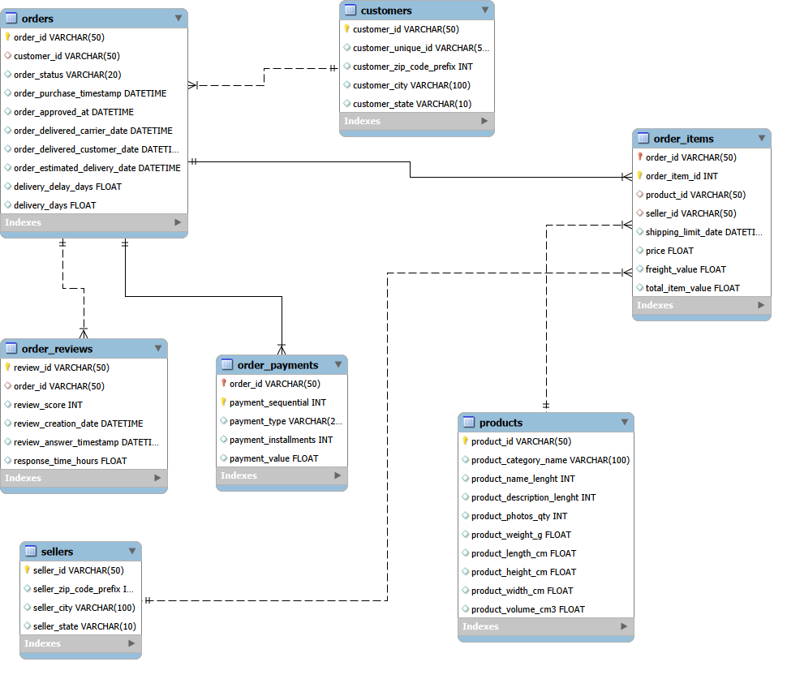

🛒 E-Commerce Sales Analysis

End-to-end data analysis project using Python, SQL, and Power BI.

🎯 Objective

Analyze revenue, customer behavior, seller performance, and delivery impact.

🛠️ Tools

Python | SQL | Power BI

🔄 Workflow

Python → SQL → Power BI → Insights

📊 Key Insights

Revenue: 3.4M, peak in May–August

78% payments via Credit Card

Top customers & sellers drive major revenue

Late delivery reduces ratings

## 🗺️ ER Diagram

## 📊 Dashboards

### Executive Overview

### Customer Insights

### Seller Performance

### Delivery & Satisfaction

📂 Dataset

Customers, Orders, Products, Payments, Sellers, Reviews, Orders_item
